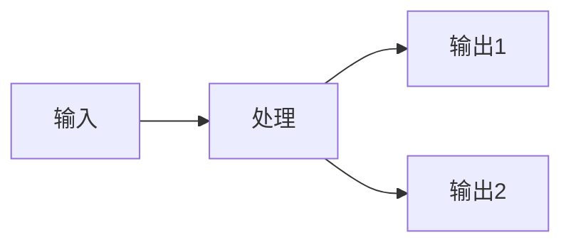

# JLC ERP 需求文档生成

为嘉立创 SMT ERP 原型项目生成标准化的需求设计文档，含截图和交互录屏。

## 输出位置

```
D:\Project\vue\JLC-ERP\需求文档\{功能名}/
├── {功能名}.md           ← 需求文档主体
└── screenshots/           ← 截图和录屏
    ├── 01-xxx.png
    ├── 02-xxx.png
    └── 03-xxx.webm
```

## 文档结构模板

根据功能复杂度选择合适的章节组合。不需要的章节直接跳过，不要留空章节。

### 标准结构

```markdown
# 需求文档：{功能名}

---

## 1. 背景

### 1.1 现状（问题）
描述当前系统存在的问题或痛点。用表格列出痛点更清晰。

### 1.2 核心需求
一句话说清楚要做什么，用引用块突出核心问题：
> **要解决的关键问题是什么？**

### 1.3 与现有功能的关系（如有）
用对比表格说明新功能和已有功能的区别。

---

## 2. 功能概述

### 2.1 页面入口
在哪个页面、哪个页签下。附规则列表截图。


### 2.2 功能清单
| 序号 | 功能模块 | 说明 | 章节 |
|------|---------|------|------|
| 1 | ... | ... | 3.1 |

---

## 3. 详细设计

每个功能模块一个子章节（3.1、3.2、3.3...）。每个子章节包含：

- **布局/交互说明**：控件类型、字段含义、操作流程
- **数据说明**：字段表格（列名、类型、取值）
- **原型截图**：``
- **交互录屏**（如有）：`[演示视频](screenshots/0x-xxx.webm)`

### 交互操作章节
如果页面有复杂交互（图表联动、隐藏/显示、拖拽等），单独列一个章节，每个交互配一段录屏。

---

## 4. 数据联动关系（如有）
用 Mermaid 流程图描述数据流向，保持简洁（5-8个节点）：



联动规则用文字列表补充说明。

---

## 5. 数据总览（如有）
汇总表格展示当前数据规模和分布。

---

## 6. 使用场景
| 场景 | 操作 |
|------|------|
| 场景描述 | 具体操作步骤 |
```

## 写作原则

### 必须做

- **中文撰写**，术语保持 ERP 领域惯用说法
- **截图配在对应章节旁**，不要集中放在文档末尾
- **交互录屏每个交互一段**，不要把所有交互合成一个视频
- **表格优先**，能用表格的不用文字段落
- **引用块突出核心问题** `> **问题是什么？**`
- 有数据支撑的结论附上数据表格

### 不要做

- 不写虚构的 URL 路径（这是本地原型，没有线上地址）
- 不写技术实现章节（文件清单、代码结构、技术要点）— 那是代码的事
- 不写页面布局 ASCII 图 — 有截图就够了
- 不留空章节，没内容的直接跳过
- 不写通用的开发规范

## 截图规范

配合 `page-capture` skill 使用。核心要求：

- **viewport 1920x1080**
- **收起侧边栏**后截图
- **用 `clip` 裁剪到内容区域**，去掉侧边栏/顶栏/tab栏
- 滚动分段截图，一屏截不下的分 2-3 张
- 文件命名：`01-功能描述.png`、`02-功能描述.png`

## 录屏规范

- **一个交互一段视频**（图例隐藏、筛选切换、拖拽排序各一段）
- 注入可见鼠标指示器（红点）
- 操作前移动鼠标到目标位置，停顿 500ms
- 操作后停顿 1500ms 展示效果
- 如有联动效果，滚动展示下游变化
- 文件命名：`05-交互描述.webm`
- ECharts canvas 点击用 `dispatchEvent` 方式

## 章节取舍指南

| 功能类型 | 建议章节 |
|---------|---------|
| 简单列表页（CRUD） | 1背景 + 2概述 + 3详细设计 + 截图 |
| 配置页（卡片/规则） | 1背景 + 2概述 + 3详细设计 + 6使用场景 + 截图 |
| 可视化/图表页 | 全部章节 + 交互录屏 |
| 多页面联动功能 | 全部章节 + Mermaid 流程图 |

## Mermaid 图规范

- 用 `flowchart LR`（左到右）或 `flowchart TB`（上到下）
- 节点不超过 8 个
- 不用 emoji
- 不用 subgraph 嵌套超过 2 层
- 联动细节用文字列表补充，不要全塞进图里

## 已有需求文档参考

| 文档 | 类型 | 特点 |
|------|------|------|
| `订单加急管理/` | 多页面联动 | 数据驱动的背景分析、对比表格、完整流程 |
| `生产基地规则-覆盖分析/` | 可视化分析 | 交互录屏、Mermaid 数据流、使用场景表 |
| `生产可视化看板/` | 图表看板 | 外部资源截图 |

新文档风格参考最近的 `生产基地规则-覆盖分析/`。
